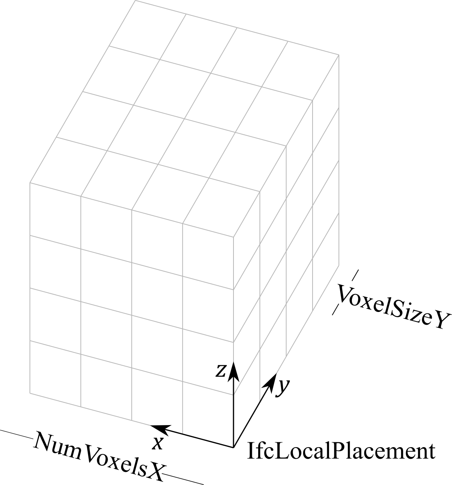
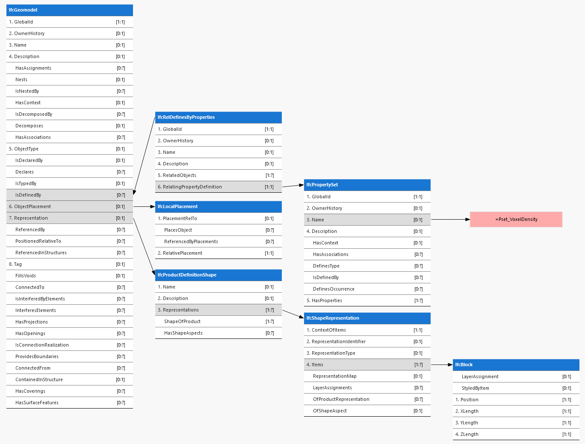
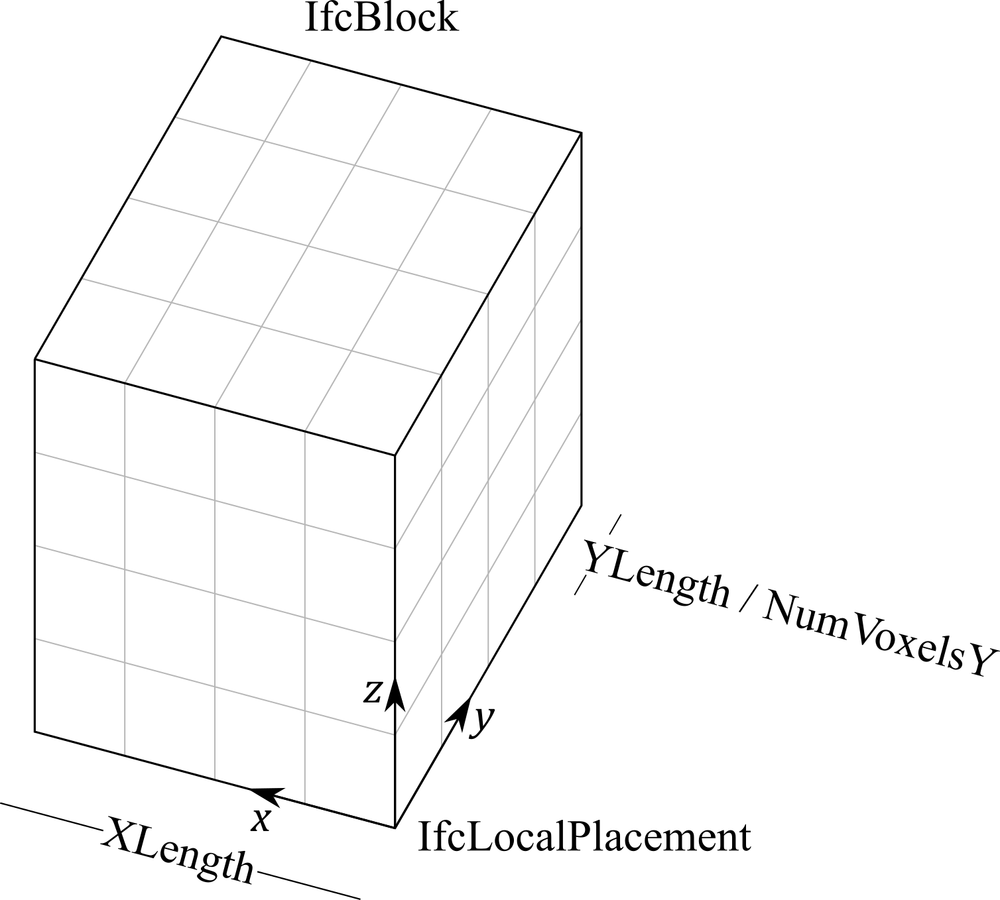

# On Voxels in IFC

*Thomas Krijnen - Aug 2 2022 - <thomas@aecgeeks.com>*

## Voxels as fields of values

In IFC representatation governs the physical or symbolic manifestation of an element.

The voxel grid as proposed by Tunnel is not the shape of an element, it's a continuous field of interpolated measurement values bounded by the relevance to a project area.

As such, the property domain is a much more natural fit for this new paradigm. The solution direction could be to extend IfcValue (used by IfcProperty) to efficiently represent Nd grids of values.

## Proposal

### IfcGeomodel definition (existing)

> volumetric geological and geotechnical model, usually an interpretation but sometimes created direct from ground penetrating measurement

## Proposal 2

## "Pset_VoxelDensity"

In both cases the voxel data would be supplied as part of a Pset that. In the second case `VoxelSizeXYZ` can be omitted as it would be defined by the spatial extent of the geometric block.

Property Name | Property Value | Property Type
--------------|----------------|--------------
NumVoxelsX    | 4              | *IfcCountMeasure*
NumVoxelsY    | 4              | *IfcCountMeasure*
NumVoxelsZ    | 4              | *IfcCountMeasure*
VoxelSizeX    | 0.1            | *IfcLengthMeasure*
VoxelSizeY    | 0.1            | *IfcLengthMeasure*
VoxelSizeZ    | 0.1            | *IfcLengthMeasure*
VoxelValues   | ...            | *IfcArray3dOfDensityMeasure*

## Type addition

When using this proposal the only addition to the schema is the augmentation of the IfcValue select to contain Nd type definitions, as illustrated below:

With *IfcArray3dOfDensityMeasure* along the lines of:

~~~
TYPE IfcArray3dOfDensityMeasure = LIST[0:?] OF LIST[0:?] OF LIST[0:?] OF IfcDensityMeasure;
END_TYPE
~~~
