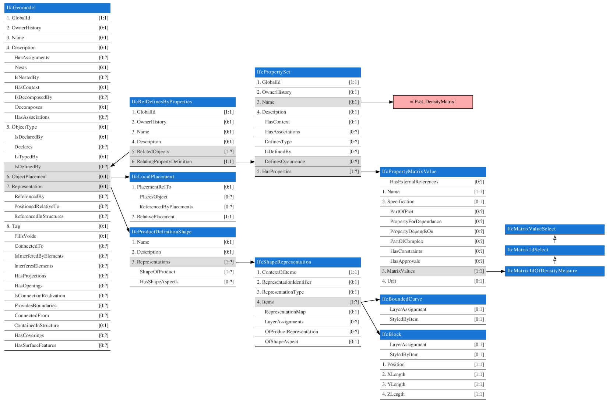

# Voxels in IFC4.4

## Executive summary

The IfcTunnel project proposes a mechanism for storing voxels as geometric items.

This report documents an alternative approach to represent voxels leverages property sets and hence:

- has less cross-domain dependencies (no tight coupling between representation, assignment relationships and product)
- is more general (because it supports 1d, 2d and 3d arrays)
- is more flexible (additional properties can be added without compatibility concerns, flexibility of representation remains)
- is more efficient (no additional boolean sequence for missing values, but sentinels)
- less implementation impact (because geometry domain remains unaltered)

## Voxels as fields of values

In IFC the representation of an element governs its physical or symbolic manifestation.

The voxel grid as proposed by Tunnel is not the shape of an element, it's a continuous field of interpolated measurement values bounded by the relevance to a project area.

As such, the property domain is a much more natural fit for this new paradigm. The solution direction could be to introduce a new IfcProperty subtype to efficiently represent Nd grids of values.

Within the Tunnel project, additional evidence for the property domain being a more natural fit is seen in the cross-domain dependencies introduced in [0]. Strict dependencies are created here between product, representation and assignment relationships by means of where rules. These break the modular flexibility and composability that makes IFC a powerful standard. 

[0] https://github.com/bSI-InfraRoom/IFC-Specification/pull/532 

## Proposal

### IfcGeomodel definition (existing)

> volumetric geological and geotechnical model, usually an interpretation but sometimes created direct from ground penetrating measurement

A placement is required to spatially position and orient the field of values. Either a geometric form can be used to spatially bound the values, or only the placement is used in which case `VoxelSizeX`/Y/Z are appended to the property set.

### "Pset_DensityMatrix"

The voxel data would be supplied as part of a Pset:

Property Name | Property Value | Property Type | Property Value Type
--------------|----------------|---------------|--------------------
VoxelSizeX    | 0.1            | Single        | *IfcLengthMeasure*
VoxelSizeY    | 0.1            | Single        | *IfcLengthMeasure*
VoxelSizeZ    | 0.1            | Single        | *IfcLengthMeasure*
VoxelValues   | ...            | Matrix        | *IfcMatrix3dOfDensityMeasure*

### Missing values

Within the Tunnel project missing values are encoded by means of an additional flattened boolean array of values.

The usage of a "mask" value would be more efficient, because it wouldn't require an additional array to be supplied. This is a concept in array programming frameworks such as fortran and numpy where one specific sentinel value is chosen to indicate a missing value.

In this way there is also less room for error as would be the case when requiring to unflatten an array to the 3d list of values.

Property Name | Property Value | Property Type | Property Type
--------------|----------------|---------------|--------------------
...           |                |
MaskValue     | -1.e200        | Single        | *IfcDensityMeasure*

### Additional properties

One major advantage is that the usage of voxels inherits the flexibility of property sets. Given that this is a new development with a wide variety of application areas and value types, this is highly preferable.

Property Name | Property Value | Property Type | Property Type
--------------|----------------|---------------|--------------------
...           |                |
Uncertainty   | 0.001          | Single        | *IfcRatioMeasure*

### Type addition

When using this proposal the only addition to the schema is the augmentation of the IfcValue select to contain Nd type definitions, as illustrated below:

With Nd types defined along the lines of:

~~~
TYPE IfcMatrix1dOfDensityMeasure = LIST[0:?] OF IfcDensityMeasure;
END_TYPE;

TYPE IfcMatrix2dOfDensityMeasure = LIST[0:?] OF LIST[0:?] OF IfcDensityMeasure;
END_TYPE;

TYPE IfcMatrix3dOfDensityMeasure = LIST[0:?] OF LIST[0:?] OF LIST[0:?] OF IfcDensityMeasure;
END_TYPE;

TYPE IfcMatrix1dOfForceMeasure = LIST[0:?] OF IfcForceMeasure;
END_TYPE;

TYPE IfcMatrix2dOfForceMeasure = LIST[0:?] OF LIST[0:?] OF IfcForceMeasure;
END_TYPE;

TYPE IfcMatrix3dOfForceMeasure = LIST[0:?] OF LIST[0:?] OF LIST[0:?] OF IfcForceMeasure;
END_TYPE;

...
~~~

Selects grouping the types by dimensionality so that it's easy to test for dimensionality of the array in a derived attribute (`typeof()` returns selected refering to an entity in the set of type strings).

~~~
TYPE IfcMatrix1d = SELECT(
    IfcMatrix1dOfDensityMeasure,
    IfcMatrix1dOfForceMeasure,
    ...
)

TYPE IfcMatrix2d = SELECT(
    IfcMatrix2dOfDensityMeasure,
    IfcMatrix2dOfForceMeasure,
    ...
)

...

TYPE IfcMatrixValueSelect = SELECT(
    IfcMatrix1dSelect,
    IfcMatrix2dSelect,
    IfcMatrix3dSelect
)
~~~

Various functions can be added to interrogate the type

~~~
FUNCTION IfcMatrixDim(v) : IfcInteger
    IF 'IFC4X4.IfcMatrix1dSelect' IN TYPEOF(v)
      return 1
    ...
END_FUNCTION;
~~~

Final property value definition

~~~
ENTITY IfcPropertyMatrixValue
 SUBTYPE OF (IfcProperty);
   MatrixValues: IfcMatrixValueSelect;
   Unit : OPTIONAL IfcUnit;
 DERIVE
   Dim : IfcInteger = IfcMatrixDim(SELF\MatrixValues)
   Size : ARRAY[1:Dim] OF IfcInteger = IfcMatrixSize(SELF\MatrixValues)
   ...
 WHERE
   IsRectangularMatrix : IfcIsRectangularMatrix(SELF\MatrixValues)
   ...
END_ENTITY;
~~~

### Further generalization

In subsequent releases of the specification, this approach can be harmonized with other tabular forms of data such as structural load cases so that we're building towards a internally consistent standard.
